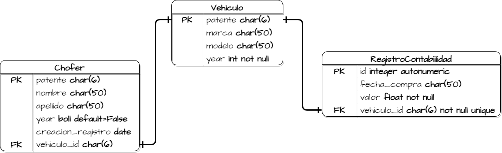
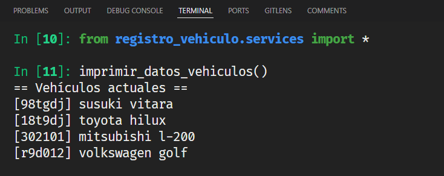
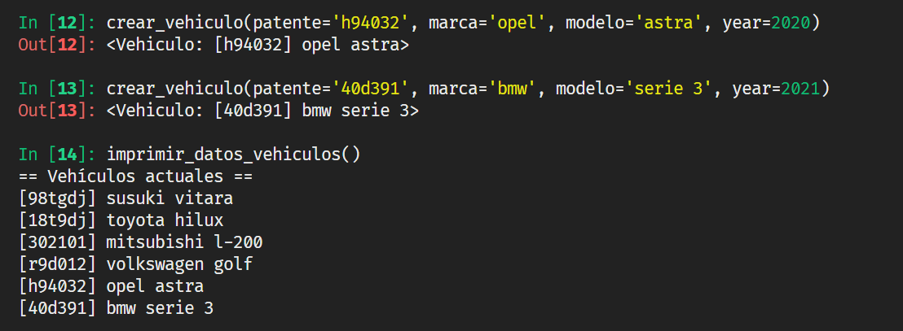

# Desafío m7_03 - Vehículos empresa

## Diagrama



## Screenshot

Mostrar datos vehículos



Crear vehículo



Crear chofer


## Modelos

```py
# models.py
from django.db import models
from django.core.exceptions import ValidationError

class Vehiculo(models.Model):
    patente = models.CharField(max_length=6, primary_key=True)
    marca = models.CharField(max_length=20, null=False)
    modelo = models.CharField(max_length=20, null=False)
    activo = models.BooleanField(default=False)
    year = models.IntegerField()

    def clean(self):
        if len(self.patente) > 6 or len(self.patente) < 6:
            raise ValidationError(
                "patente no válida, la patente debe tener una longitud exacta de 6 caracteres"
            )

    def save(self, *args, **kwargs):
        self.clean()
        super().save(*args, **kwargs)

    def __str__(self):
        return f"[{self.patente}] {self.marca} {self.modelo}"

class Chofer(models.Model):
    rut = models.CharField(max_length=9, primary_key=True)
    nombre = models.CharField(max_length=50, null=False)
    apellido = models.CharField(max_length=50, null=False)
    activo = models.BooleanField(default=False)
    creacion_registro = models.DateField(auto_now=True)
    vehiculo = models.OneToOneField(Vehiculo, on_delete=models.CASCADE)

class RegistroContabilidad(models.Model):
    fecha_compra = models.DateField(null=False)
    valor = models.FloatField(null=False)
    vehiculo = models.OneToOneField(Vehiculo, on_delete=models.CASCADE)
```

## Servicios

```py
# services.py
from .models import Vehiculo, Chofer, RegistroContabilidad

def crear_vehiculo(patente, marca, modelo, year):
    return Vehiculo.objects.create(
        patente=patente, marca=marca, modelo=modelo, year=year
    )

def crear_chofer(rut, nombre, apellido, creacion, vehiculo):
    chofer = Chofer(
        rut=rut,
        nombre=nombre,
        apellido=apellido,
        creacion_registro=creacion,
        vehiculo=vehiculo,
    )
    chofer.save()

def crear_registro_contable(fecha_compra, valor, vehiculo):
    RegistroContabilidad(
        fecha_compra=fecha_compra, valor=valor, vehiculo=vehiculo
    ).save()

def deshabilitar_chofer(chofer):
    chofer = Chofer.objects.get(pk=chofer.rut)
    chofer.activo = False
    chofer.save()

def deshabilitar_vehiculo(vehiculo):
    vehiculo = Vehiculo.objects.get(pk=vehiculo.patente)
    vehiculo.activo = False
    vehiculo.save()

def habilitar_chofer(chofer):
    chofer = Chofer.objects.get(pk=chofer.rut)
    chofer.activo = True
    chofer.save()

def habilitar_vehiculo(vehiculo):
    vehiculo = Vehiculo.objects.get(pk=vehiculo.patente)
    vehiculo.activo = True
    vehiculo.save()

def obtener_vehiculo(vehiculo):
    return Vehiculo.objects.get(pk=vehiculo.patente)

def obtener_chofer(chofer):
    return Chofer.objects.get(pk=chofer.rut)

def asignar_chofer_a_vehiculo(chofer, vehiculo):
    try:
        actualizado = Chofer.objects.filter(rut=chofer.rut).update(vehiculo=vehiculo)
        if actualizado == 1:
            print("Se actualizo correctamente")
    except Exception as e:
        print(e)

def imprimir_datos_vehiculos():
    print("== Vehículos actuales ==")
    for vehiculo in Vehiculo.objects.all():
        print(vehiculo)
```
